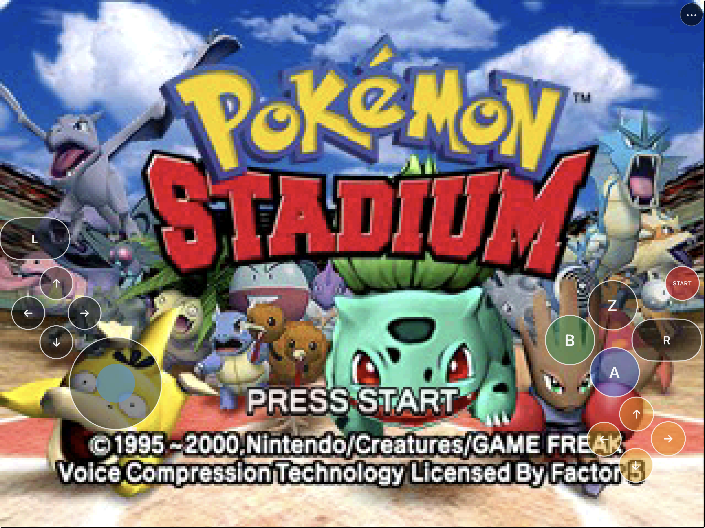
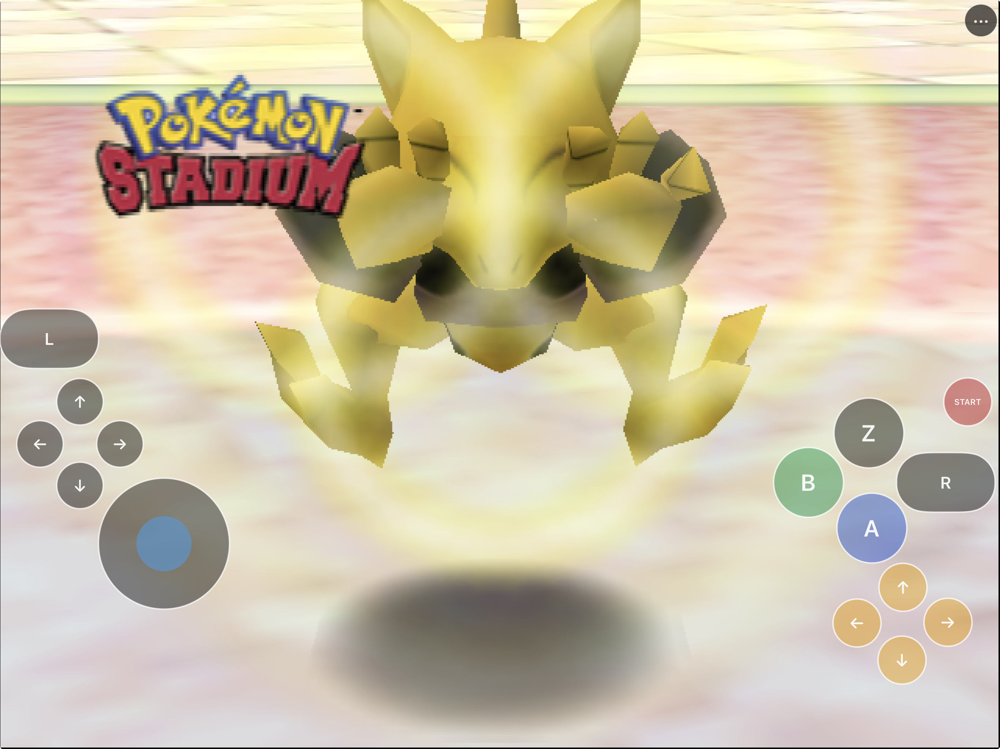
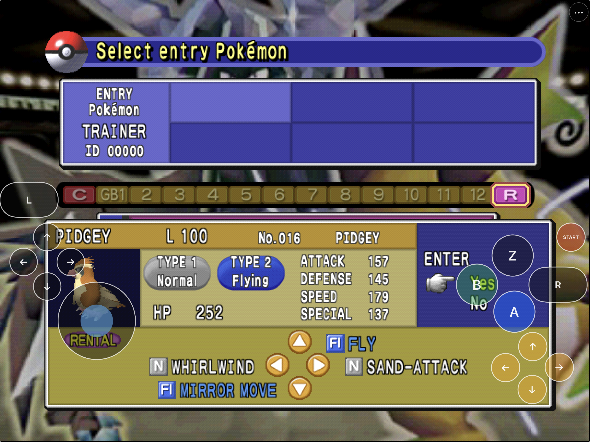
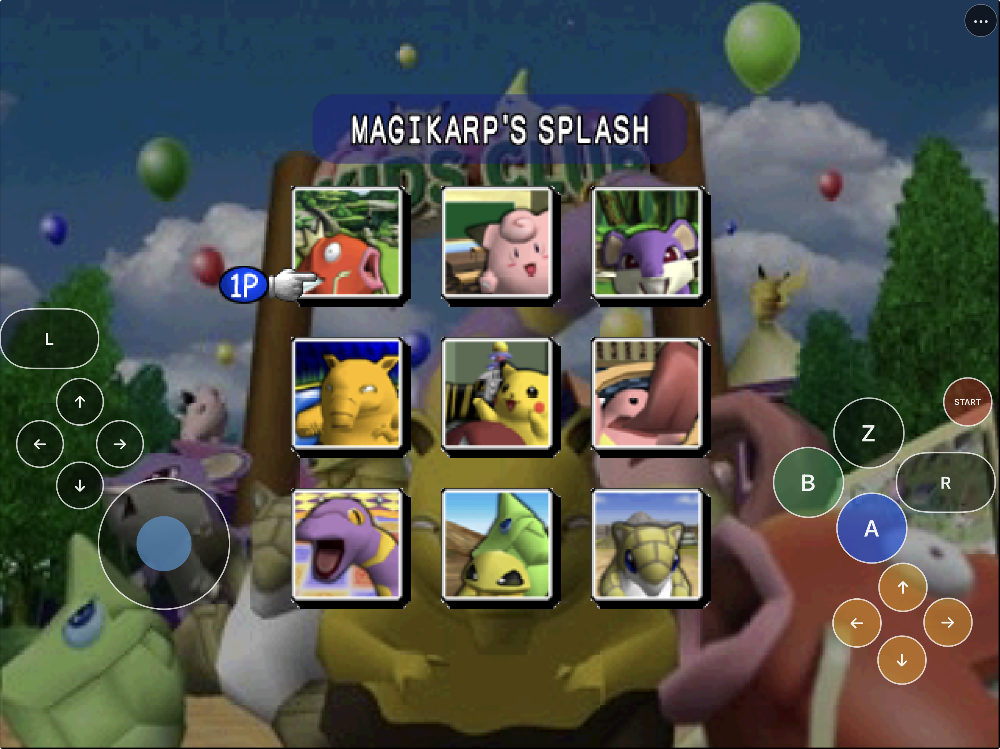
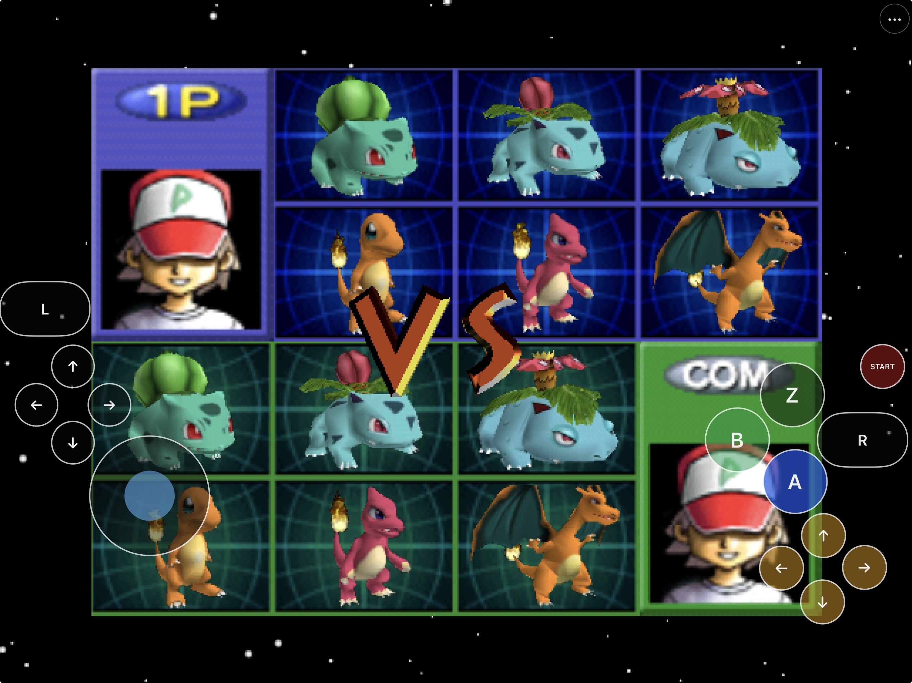
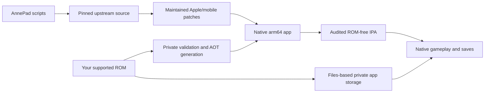

# AnnePad

Pokémon Stadium via static recompilation, rebuilt for iPhone and iPad.
Native Metal rendering, Files-based setup, touch controls, persistent saves,
and reproducible ROM-free builds.



AnnePad packages the [Pokémon Stadium recompilation
project](https://github.com/mstan/PokemonStadiumRecomp) as a native Apple app.
It runs ahead-of-time compiled arm64 code through Metal, imports a user-provided
Pokémon Stadium (US) 1.0 ROM through Files, and supplies a landscape touch
controller that can be customized or hidden when using a physical controller.

No ROM, save, extracted Nintendo asset, signing identity, or provisioning
profile is included in this repository or its IPA. This repository contains the
Apple integration and reproducible build scripts; it does not distribute
Pokémon Stadium or ROM-derived game data. See the [legal and asset
boundaries](docs/LEGAL-AND-ASSET-BOUNDARIES.md).

## Install status

| Option | Status | What to do |
|---|---|---|
| Developer-preview `.ipa` | **Available with a computer** | [Download preview 0.1.0 build 3](https://github.com/chrissotraidis/annepad/releases/tag/v0.1.0-preview.3), then re-sign it with your Apple ID using AltStore Classic and AltServer by following the [installation guide](docs/INSTALL_IPA.md). |
| Local iPhone or iPad build | **Available now** | Build and sign with your Apple development team using the instructions below. |
| Simulator | **Available now** | Best for development and UI testing; it is not a substitute for physical-device testing. |
| App Store / TestFlight | **Not announced** | No listing or public TestFlight currently exists. |

The current development build has been signed, installed, and played on a
physical iPad. Files import, Metal rendering, touch gameplay, the settings and
layout editors, resolution changes, saves, relaunch, and in-place updates have
all been exercised on that hardware. Physical-controller, headphone/Bluetooth,
interruption, thermal, and full iPhone acceptance remain separate test work.

The downloadable IPA is unsigned and ROM-free. It contains no maintainer
certificate or provisioning profile and must be re-signed for the installer's
device.

## Get started

You need:

- an Apple Silicon Mac;
- Xcode and its command-line tools;
- CMake, Ninja, Git, and Python;
- enough free storage for the generated AOT source and build trees; and
- your own legally obtained Pokémon Stadium (US) 1.0 ROM.

The supported normalized ROM is 32 MiB with MD5
`ed1378bc12115f71209a77844965ba50`. AnnePad accepts `.z64`, `.v64`, and `.n64`
byte orders and verifies the exact revision before use.

```sh
git clone https://github.com/chrissotraidis/annepad.git
cd annepad

./scripts/check-prerequisites.sh
./scripts/fetch-sources.sh
./scripts/prepare-game.sh --rom /absolute/path/to/your-game.v64
./scripts/build-host-tools.sh
./scripts/generate-game.sh --rom /absolute/path/to/your-game.v64

# Playable Simulator app
./scripts/build-ios-simulator.sh

# Audited, unsigned iPhoneOS app and IPA
./scripts/package-ios.sh
```

The optimized AOT compile is intentionally substantial. On a memory-constrained
Mac, limit parallel jobs:

```sh
ANNEPAD_BUILD_JOBS=2 ./scripts/package-ios.sh
```

See [`docs/BUILDING.md`](docs/BUILDING.md) for the complete macOS, Simulator,
device-signing, packaging, audit, rollback, and clean-checkout workflow.

## First launch

AnnePad never downloads game data.

1. Launch the app in landscape.
2. Choose **Choose ROM** on the native setup screen.
3. Select your legal Pokémon Stadium (US) 1.0 dump from Files.
4. AnnePad validates its size and hash, normalizes the byte order, and stores a
   private protected copy in the app container.
5. After **Verified. Starting Pokémon Stadium…**, the native game begins.

The in-game utility button keeps **Replace ROM**, **Remove ROM**, and **Edit
Touch Layout** reachable without placing a permanent settings strip over
gameplay. The user ROM and saves remain private to the app container and are
excluded from Git and the package audit.

## Touch controls

AnnePad feeds touch input into the same normalized N64 input snapshot used by
its other input paths. It does not patch Pokémon Stadium's gameplay logic to
fake touch behavior.

- **Left side:** protected analog stick and compact D-pad.
- **Right side:** A, B, Z, four C buttons, Start, L, and R.
- **Phone layout:** primary controls sit in the landscape side rails to keep
  the game surface visible.
- **Tablet layout:** wider low-grip placement for two-handed play.
- **Customize:** move, resize, hide, show, or reset individual controls while
  the game is running; global opacity and separate phone/tablet layouts persist
  between launches.
- **Multitouch:** independent button lifetimes preserve quick taps and held
  shoulders without cross-extension or stuck input.
- **Controller coexistence:** touch controls can be hidden while using a
  physical controller; hardware acceptance still requires a real device.

AnnePad's controller backend is SDL2 2.32.10. Preview 3 reconciles current SDL
controller instance IDs with four stable player slots at startup, controller
add/remove/remap events, foreground resume, and a bounded active check. A stale
or detached handle is closed, its input becomes neutral, a sole returning pad
reclaims player 1, and an additional pad takes the next free slot. This behavior
has deterministic regression coverage; Bluetooth, wired, natural-sleep, full
mapping, and two-controller acceptance still require hands-on hardware tests.

Pokémon Stadium uses held R to reveal battle move assignments, L for cancel in
relevant battle paths, and edge-triggered Z actions. AnnePad therefore keeps Z
as a normal press-and-hold touch.

## Current screenshots

<table>
  <tr>
    <td width="50%">
      
    </td>
    <td width="50%">
      
    </td>
  </tr>
  <tr>
    <td align="center"><strong>Battle at a glance</strong><br>Every core N64 control remains within reach in landscape.</td>
    <td align="center"><strong>Explore Stadium</strong><br>Touch input stays present across the game’s menu-driven modes.</td>
  </tr>
  <tr>
    <td width="50%">
      
    </td>
    <td width="50%">
      
    </td>
  </tr>
  <tr>
    <td align="center"><strong>Pick a team</strong><br>Choose rental Pokémon using the same touch layout.</td>
    <td align="center"><strong>Ready for the match</strong><br>Move from team selection into a Stadium battle without a controller.</td>
  </tr>
</table>

These project-provided iPad captures use privately supplied local game data. No
game data is stored in this repository or distributed with the app.

## What works

| Area | Current result |
|---|---|
| Native runtime | Static AOT arm64 game code; no general emulator wrapper, JIT, TCC, LiveRecomp, or runtime plugin loading in iOS builds |
| Rendering | Direct Metal RT64 path on macOS, iPhone/iPad Simulator, and physical iPad |
| Gameplay | Complete rental battles on native macOS and touch-only Simulator; the signed iPad build boots and plays through touch |
| Performance | Automatic title/attract averages 29.96 presents/s; controlled two-turn battle averages 29.47 presents/s against the game's 30 Hz cadence |
| Touch | Analog stick, D-pad, A/B/Z, C buttons, shoulders, Start, pressed feedback, safe areas, and persistent customization |
| ROM setup | Native Files picker, exact US 1.0 validation, normalization, replacement, and removal |
| Saves | Serialized snapshots, atomic replacement, backup rotation, corrupt-primary quarantine/recovery, background flush, and relaunch persistence |
| Lifecycle | iPhone and iPad Simulator soaks retain the same process across foreground, Settings background, and restored foreground intervals |
| Controllers | SDL2 instance-ID ownership is reconciled across disconnect, reconnect, remap, and foreground resume; deterministic slot/input tests pass, while hands-on hardware acceptance remains open |
| Packaging | ROM-free arm64 iPhoneOS app and unsigned IPA with deterministic content manifest and fail-closed audit |

For the evidence ledger and honest remaining gates, read
[`docs/STATUS.md`](docs/STATUS.md), [`docs/TESTING.md`](docs/TESTING.md), and
[`docs/RELEASE-CHECKLIST.md`](docs/RELEASE-CHECKLIST.md).

## Supported game

| Game | Engine | Status |
|---|---|---|
| Pokémon Stadium (US) 1.0 | [Pokémon Stadium recompilation project](https://github.com/mstan/PokemonStadiumRecomp) | Supported |
| Other Pokémon Stadium revisions and games | — | Not supported by this app |

AnnePad is a native source-port integration, not a general Nintendo 64 emulator.
It accepts only the exact US 1.0 ROM identified above.

## Reproducible and ROM-free



`dependencies.lock.json` pins every source revision. Fetch scripts disable
dependency push URLs, maintained patches are checked both forward and in
reverse, and ROM-derived intermediate source remains ignored. The package audit
rejects ROMs, saves, extracted assets, Simulator slices, private paths,
credentials, provisioning profiles, signing keys, and debug-only release
surfaces.

Preview 3 normalizes staged file times, so two local package passes produced the
same IPA bytes. The IPA SHA-256 is
`aaff759f17f127e2bbfe2125f01f0f1effdf0640f76d332444f818fc6cadd85d`;
the independently audited sorted-content manifest SHA-256 is
`1c1b9db69aeb69b54be7f615a6f113552405b1b9a2c54c16a1e3df481fb142c6`.

## Physical-device handoff

When an Apple development team and an iPhone or iPad are available:

```sh
DEVELOPMENT_TEAM="your-local-team-id" \
  ./scripts/build-ios-device.sh release signed
./scripts/install-ios-device.sh --device "attached-device-name-or-id"
```

The signed product is isolated under
`build-ios-app-device-release-signed/Release/AnnePad.app`. The physical-iPad
path has been exercised; iPhone ergonomics, the controller matrix, audio-route
interruptions, and broader hardware coverage remain open.

## Frequently asked questions

<details>
<summary><strong>Is AnnePad an emulator?</strong></summary>

No. AnnePad uses static recompilation: generated C code is compiled ahead of
time into the native arm64 application. The iOS build audit rejects dynamic
recompilers, JIT-related facilities, and general runtime plugin loading.
</details>

<details>
<summary><strong>Does this repository include Pokémon Stadium?</strong></summary>

No. You must provide your own legally obtained Pokémon Stadium (US) 1.0 ROM.
Do not open issues requesting game data or download links.
</details>

<details>
<summary><strong>Is the game playable?</strong></summary>

Yes. Native macOS completed a full rental battle, iPad Simulator completed a
separate full rental battle using touch only, and the signed build has been
installed and played on a physical iPad. The broader controller, audio-route,
iPhone, and device matrix remains incomplete.
</details>

<details>
<summary><strong>Where is the IPA?</strong></summary>

[Download the unsigned developer-preview IPA from GitHub
Releases](https://github.com/chrissotraidis/annepad/releases/tag/v0.1.0-preview.3).
It is not an App Store or TestFlight build. A Mac or Windows PC running
AltServer is required to re-sign it with your own Apple ID through AltStore
Classic. There is currently no supported computer-free installation path.
</details>

<details>
<summary><strong>Do physical controllers work?</strong></summary>

The SDL2 controller path feeds the normalized N64 input path. Preview 3 repairs
stale-handle and player-slot ownership after disconnect, reconnect, and
foreground resume, with deterministic regression coverage. It has not yet
completed the required real-iPhone and real-iPad controller matrix, so hardware
support is not claimed as accepted.
</details>

<details>
<summary><strong>What is the licensing status?</strong></summary>

Each upstream component retains its own copyright and license. Some pinned
upstream components do not provide a repository-level license grant, so this
free, unsigned, ROM-free developer preview should not be treated as a broad
open-source, commercial, or official-store license. See the scoped [legal and
asset boundaries](docs/LEGAL-AND-ASSET-BOUNDARIES.md).
</details>

## Project map

| Path | Purpose |
|---|---|
| [`apple/`](apple/) | Native Apple shell, ROM setup, touch UI, lifecycle, audio, and platform bridges |
| [`patches/`](patches/) | Maintained changes replayed onto exact upstream revisions |
| [`dependencies.lock.json`](dependencies.lock.json) | Machine-readable source pins |
| [`scripts/fetch-sources.sh`](scripts/fetch-sources.sh) | Materialize and verify the locked source graph |
| [`scripts/build-ios-simulator.sh`](scripts/build-ios-simulator.sh) | Build the playable release-profile Simulator app |
| [`scripts/build-ios-device.sh`](scripts/build-ios-device.sh) | Build unsigned or locally signed iPhoneOS apps |
| [`scripts/package-ios.sh`](scripts/package-ios.sh) | Build and audit the unsigned IPA |
| [`scripts/verify-clean-checkout.sh`](scripts/verify-clean-checkout.sh) | Fail-closed isolated rebuild and manifest comparison |
| [`docs/ARCHITECTURE.md`](docs/ARCHITECTURE.md) | Game core, renderer, Apple shell, input, saves, and packaging design |
| [`docs/BUILDING.md`](docs/BUILDING.md) | Complete reproducible build and signing handoff |
| [`docs/INSTALL_IPA.md`](docs/INSTALL_IPA.md) | Install the unsigned developer preview with AltStore Classic |
| [`docs/TESTING.md`](docs/TESTING.md) | Automated, Simulator, and physical-device acceptance matrix |
| [`docs/STATUS.md`](docs/STATUS.md) | Current proven behavior and next concrete gate |

Generated sources, external checkouts, ROMs, saves, build directories, logs,
IPAs, and signing material are intentionally ignored.

## Legal and acknowledgements

AnnePad builds on PokémonStadiumRecomp, the Pokémon Stadium decompilation work,
N64Recomp, N64ModernRuntime, RT64, SDL, and their contributors. Each project
retains its own copyright and license. AnnePad does not relicense upstream or
reverse-engineered material and does not conceal its origin.

Before sharing source, screenshots, or a binary, follow the
[`legal and asset boundaries`](docs/LEGAL-AND-ASSET-BOUNDARIES.md) and the
[`release checklist`](docs/RELEASE-CHECKLIST.md).
